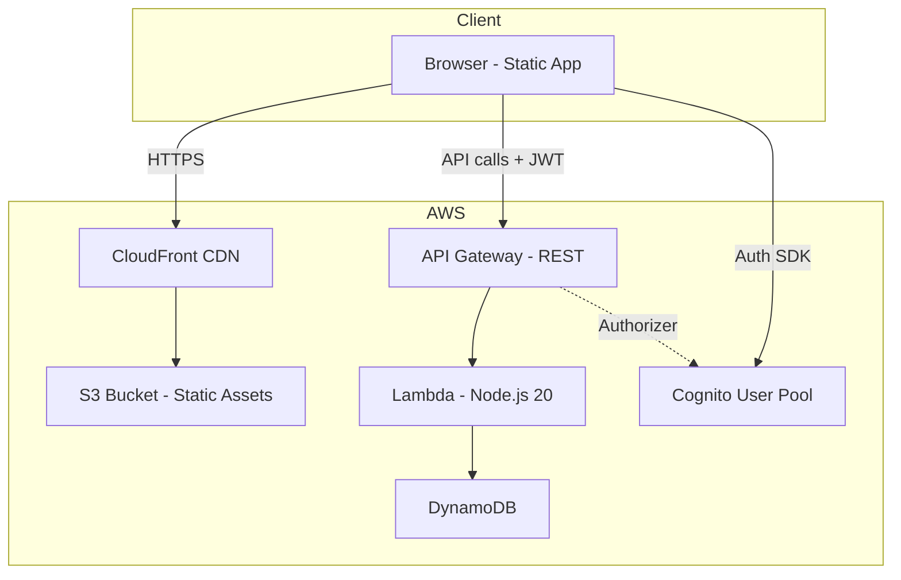
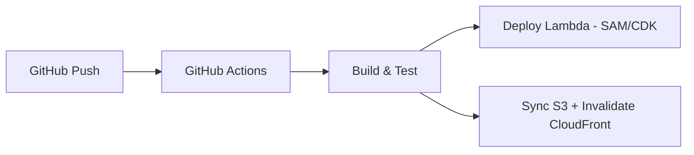

# KV ExpenseTracker — AWS Design Doc

## Overview

Migrate KV from a client-side localStorage app to a production-ready AWS-hosted application with proper authentication, per-user data isolation, and serverless backend.

## Architecture



---

## Services

### 1. Frontend Hosting

| Service | Purpose |
|---------|---------|
| **S3** | Store `index.html`, `styles.css`, `app.js`, etc. |
| **CloudFront** | CDN distribution, HTTPS, custom domain, caching |

- S3 bucket configured for static website hosting (private, CloudFront-only access via OAC)
- CloudFront distribution with custom domain + ACM SSL certificate

### 2. Authentication — Amazon Cognito

| Config | Value |
|--------|-------|
| **User Pool** | Email + password sign-up/sign-in |
| **Password Policy** | Min 8 chars, uppercase, number, special char |
| **MFA** | Optional TOTP (can enable later) |
| **Token type** | JWT (ID token + access token) |
| **App Client** | SPA client (no client secret) |

Replaces `auth.js` — frontend uses `amazon-cognito-identity-js` or AWS Amplify Auth.

### 3. API Layer — API Gateway + Lambda

**API Gateway** (REST, regional):
- Cognito authorizer on all `/api/*` routes
- CORS configured for the CloudFront domain
- Throttling: 100 req/s default

**Lambda Functions** (Node.js 20, ARM64):

| Function | Route | Method | Description |
|----------|-------|--------|-------------|
| `getTransactions` | `/api/transactions` | GET | List user's transactions (with filters) |
| `addTransaction` | `/api/transactions` | POST | Create a new transaction |
| `updateTransaction` | `/api/transactions/{id}` | PUT | Update a transaction |
| `deleteTransaction` | `/api/transactions/{id}` | DELETE | Delete a transaction |
| `getSettings` | `/api/settings` | GET | Get user preferences |
| `updateSettings` | `/api/settings` | PUT | Update user preferences |
| `getBudget` | `/api/budget` | GET | Get monthly budget |
| `setBudget` | `/api/budget` | PUT | Set monthly budget |
| `exportData` | `/api/export` | GET | Export all user data as JSON |

> [!NOTE]
> Each Lambda extracts `userId` from the Cognito JWT token — no user can access another user's data.

### 4. Database — DynamoDB

#### Tables

**Transactions Table**

| Attribute | Type | Key |
|-----------|------|-----|
| `userId` | String | Partition Key |
| `txId` | String | Sort Key |
| `type` | String | — |
| `amount` | Number | — |
| `category` | String | — |
| `date` | String (ISO) | — |
| `note` | String | — |
| `paymentMethod` | String | — |
| `createdAt` | String (ISO) | — |

- **GSI:** `userId-date-index` (PK: `userId`, SK: `date`) for month-range queries

**UserSettings Table**

| Attribute | Type | Key |
|-----------|------|-----|
| `userId` | String | Partition Key |
| `currencySymbol` | String | — |
| `locale` | String | — |
| `monthlyBudget` | Number | — |

---

## Security

| Concern | Solution |
|---------|----------|
| Auth | Cognito JWT tokens (auto-refresh) |
| API Auth | API Gateway Cognito Authorizer (validates JWT) |
| Data Isolation | All queries filtered by `userId` from token |
| HTTPS | CloudFront enforces HTTPS redirect |
| CORS | API Gateway allows only CloudFront domain |
| Input Validation | Lambda validates all inputs before DynamoDB writes |
| IAM | Lambda has least-privilege DynamoDB access |

---

## Frontend Changes Required

| Current (localStorage) | New (AWS) |
|------------------------|-----------|
| `auth.js` — SHA-256 hashing | **Cognito SDK** — `signUp()`, `signIn()`, `signOut()` |
| `storage.js` — `localStorage.getItem/setItem` | **API client** — `fetch('/api/transactions')` with JWT header |
| Data shared globally | Data scoped per `userId` automatically |

Create a new `api.js` module that mirrors the `storage.js` interface but calls the REST API:

```javascript
// api.js — replaces storage.js for AWS
const API_BASE = 'https://api.yourdomain.com';

async function apiCall(path, method = 'GET', body = null) {
    const token = getIdToken(); // from Cognito session
    const res = await fetch(`${API_BASE}${path}`, {
        method,
        headers: {
            'Authorization': `Bearer ${token}`,
            'Content-Type': 'application/json',
        },
        body: body ? JSON.stringify(body) : null,
    });
    return res.json();
}

export const getTransactions = () => apiCall('/api/transactions');
export const addTransaction = (tx) => apiCall('/api/transactions', 'POST', tx);
// ... etc
```

---

## Deployment Pipeline



**Infrastructure as Code:** AWS SAM or CDK (TypeScript)

**CI/CD:** GitHub Actions workflow:
1. On push to `main` → run tests
2. `sam deploy` → update Lambda + API Gateway
3. `aws s3 sync` → upload static files
4. `aws cloudfront create-invalidation` → clear CDN cache

---

## Cost Estimate (Low Traffic)

| Service | Monthly Cost |
|---------|-------------|
| S3 + CloudFront | ~$1 |
| Cognito | Free (first 50K MAU) |
| API Gateway | ~$0.50 (first 1M calls free) |
| Lambda | ~$0 (first 1M invocations free) |
| DynamoDB (on-demand) | ~$1 |
| **Total** | **~$2–5/month** |

---

## Migration Path

| Phase | What | Effort |
|-------|------|--------|
| **Phase 1** | Host current static app on S3 + CloudFront (no backend changes) | 1 hour |
| **Phase 2** | Add Cognito auth (replace `auth.js`) | 1 day |
| **Phase 3** | Build Lambda API + DynamoDB (replace `storage.js`) | 2–3 days |
| **Phase 4** | CI/CD pipeline with GitHub Actions | 1 day |

> [!IMPORTANT]
> Phase 1 can be done immediately with zero code changes — your localStorage auth and data will still work. Phases 2–4 add real backend infrastructure.
